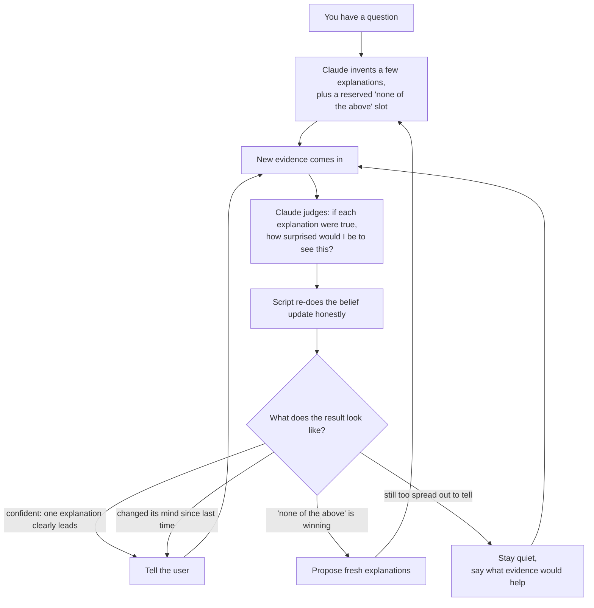
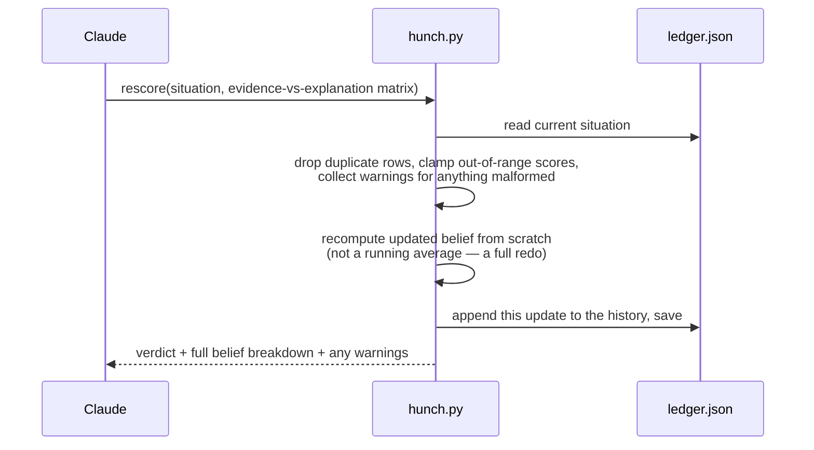
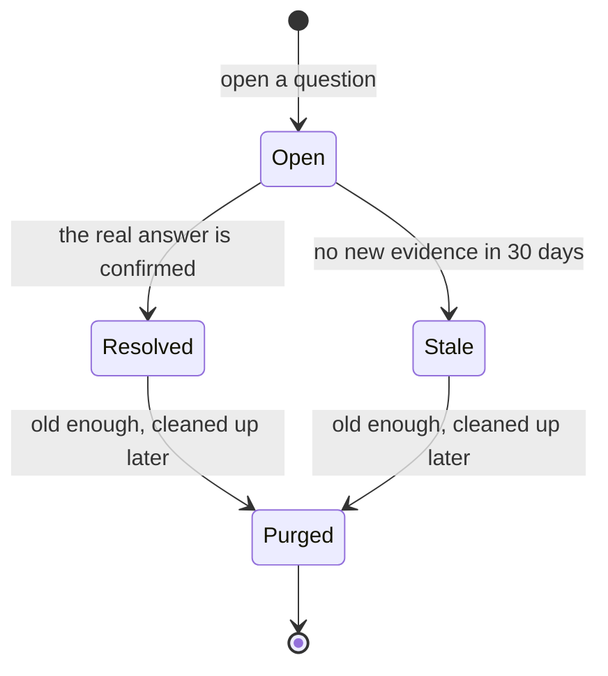
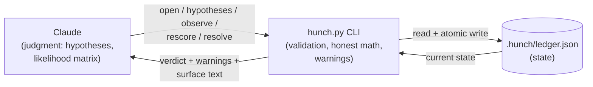

# hunch

A hunch ledger. Claude proposes explanations, `hunch.py` does the honest
arithmetic, so beliefs update instead of resetting every conversation.

`hunch` is a portable Claude skill: one Markdown file describing the
protocol (`SKILL.md`) and one zero-dependency Python script that owns the
math and the data (`hunch.py`). No build step, no external packages, no
server.

## Install

From a clone of this repo:

```bash
cd hunch
./install.sh
```

That finds a Python interpreter on your machine, symlinks `hunch/` into
`~/.claude/skills/hunch`, and runs a smoke test. You should see `PASS`
and a verdict line.

Options:

```bash
./install.sh --copy      # copy instead of symlink (no updates when you git pull)
./install.sh --force     # overwrite an existing ~/.claude/skills/hunch
```

If you'd rather do it by hand:

```bash
cp -r hunch ~/.claude/skills/hunch
# or, to track updates via git pull:
ln -s "$(pwd)/hunch" ~/.claude/skills/hunch

cd ~/.claude/skills/hunch
python3 hunch.py demo
```

A clean exit with `"ok": true` means the engine, the ledger I/O, and the
CLI wiring all work. Nothing else to configure — the ledger auto-creates on
first write, and there's no server, no API key, no dependency to `pip
install`.

## What this actually does, in plain terms

You have an open question — "why is the deploy flaky?", "why does the cat
knock things off the shelf at 3am?" Claude invents a handful of plausible
explanations and, for each one, writes down what you'd expect to see if it
were true. As real observations come in, you feed them to the script.
`hunch.py` does the arithmetic honestly — no vibes, no rounding in its
head — and only tells you it has an answer once the numbers actually point
somewhere.

**Why does a script do the math instead of the model?** Judging "how
surprising is this evidence" is exactly the kind of fuzzy call a language
model is good at. Doing the same division correctly a hundred times in a
row, with no drift, is exactly the kind of thing it's bad at. So the split
is: Claude supplies judgment, the script supplies bookkeeping. The ledger
file is the honest paper trail underneath both.

## The loop, visually



## The everyday-language glossary

**Prior — your starting guess.** Before any evidence, how likely does each
explanation seem? If you have no reason to favor one over another, you'd
split it evenly. If you already suspect the cache-clearing job, you'd give
it more weight up front.

**Likelihood — "if this explanation were true, how surprised would I be to
see this evidence?"** Scored 0 to 1: 0 means "very surprised, this
evidence barely fits," 1 means "not surprised at all, this is exactly what
I'd expect." You (Claude) fill this in for every explanation, for every
new piece of evidence.

**Posterior — your updated belief, after folding in the evidence.** This is
the number that actually moves as observations come in. It always sums to
100% across every explanation, including the "none of the above" slot.

**OTHER — the humility slot.** Every situation carries a reserved "none of
my guesses are right" bucket. It starts at 15% and is mathematically
forbidden from ever reaching exactly 0%, no matter how confident the rest
of the field looks. That's deliberate: a hypothesis list dreamed up before
seeing much evidence is often incomplete, and the tool should never claim
total certainty about an incomplete list.

**Reliability — not all evidence is equal.** A rumor nudges the numbers a
little; something you observed firsthand moves them a lot. You tag each
observation `firsthand` / `secondhand` / `rumor` / `inferred`, and the
script weights the update accordingly.

**Entropy — how spread-out the belief is.** Think of it as the difference
between a 6-way tie and one clear leader. High entropy = still a toss-up,
don't say anything yet. Low entropy = the field has narrowed to one or two
real contenders. (If you want the actual formula, it's in "the maths"
section at the bottom — you don't need it to use the tool.)

**Verdicts — what the script tells you to do next:**
- **peaked** — one explanation is clearly ahead; confident enough to say so.
- **flip** — the leader changed since last time; worth flagging explicitly.
- **confused** — none of the explanations fit well (OTHER has taken over);
  time to throw out the current guesses and propose new ones.
- **flat** — the evidence so far doesn't discriminate between explanations;
  stay quiet and say what observation would actually help.

## One rescore, step by step



If `warnings` comes back non-empty, something in the matrix you sent
didn't land cleanly (wrong id, a value outside 0–1, a duplicate row). Fix
the matrix and rescore again — don't relay a result you know is built on a
warning.

## A situation's life



Stale is a dead end for new evidence — `observe` requires an `open`
situation and errors on a stale one, so nothing reopens it. Purge or
remove are the only exits; if the question is still live, open a fresh
situation instead.

## What makes this trustworthy

**Observations that describe the same event get grouped before scoring.**
If two people describe the same outage, that shouldn't count as two
independent pieces of evidence — it would double-count and inflate
confidence. `hunch` clusters near-duplicate observations (by an explicit
hint, or automatic text-overlap matching) and scores per-cluster.

**The ledger is append-only in spirit.** Old explanations are never
deleted, only set aside when you propose a new batch — so the history of
what you believed and when stays intact even after you've completely
changed your mind. Nothing in the ledger is meant for hand-editing: every
number in it came from a specific matrix at a specific timestamp, and
that's the entire point of keeping it.

## Architecture

`hunch` is two files with a hard line between them:

- **`SKILL.md`** — the model-facing contract. This is what Claude reads to
  know when to open a situation, and it spells out the protocol verbatim:
  invent hypotheses, log observations, build a likelihood matrix, rescore,
  check warnings, gate what you say on the verdict. It contains no
  arithmetic — every number it mentions comes back from the CLI.
- **`hunch.py`** — a single-file, zero-dependency engine, organized as four
  layers top to bottom: **tuning constants** (every threshold the engine
  uses, named and commented, in one `TUNING` dict) → **text-similarity
  dedupe** (Jaccard clustering so near-duplicate observations don't
  double-count as independent evidence) → **the pure Bayesian engine**
  (renormalizing belief updates, entropy, verdicts — no I/O, no argument
  parsing) → **ledger I/O + CLI** (atomic reads/writes and the
  `argparse` command surface Claude actually calls).

Below that sits **the ledger** (`.hunch/ledger.json`, see Artifacts below),
**the tests** (`test_hunch.py`, which exercise the engine layer directly as
well as the CLI, and check `SKILL.md` stays faithful to what the CLI
actually validates), and **`install.sh`**, which links or copies `hunch/`
into `~/.claude/skills/hunch` and runs the built-in demo as a smoke test.



The trust boundary in one sentence: **the model supplies judgments as
JSON, and never touches stored state or arithmetic directly** — every read
and write to the ledger, and every number derived from it, goes through
`hunch.py`.

## Artifacts it creates

| Artifact | What it is |
|---|---|
| `.hunch/ledger.json` | The state file — every situation, hypothesis, observation, cluster, and posterior history. Lives in the current working directory of wherever Claude runs the `hunch.py` command, unless overridden with `--ledger` or the `HUNCH_LEDGER` environment variable. It's human-readable JSON, but **do not hand-edit it** — see "What makes this trustworthy" above for why. Safe to delete: that's how you make `hunch` forget everything. Safe to commit to a repo if you want shared, versioned hunches across a team — but think before you do, since hypothesis and observation text can contain workplace-sensitive content. |
| `.hunch/ledger.json.tmp*` | Transient atomic-write temp files (`save_ledger` writes to a tempfile in the same directory, then `os.replace`s it over the real ledger). Auto-cleaned on every successful write; you'd only ever see one mid-write or after a crash between the write and the rename. |
| Demo artifacts | `hunch.py demo` runs its walkthrough against a throwaway ledger in a temp directory (`hunch-demo-*`), auto-removed at the end unless you pass `--keep`. |
| `~/.claude/skills/hunch` | Created by `install.sh` — a symlink to your checkout by default, or a full copy with `--copy`. |

Nothing else. `hunch` writes nowhere else: no caches beyond the ledger
itself, no config files, no telemetry.

## FAQ

**Why does the model build the evidence-vs-explanation matrix instead of
the script inferring it?** Because "how well does this evidence fit this
explanation" is a judgment call that requires understanding the evidence —
not something a script can compute from first principles. The script's job
is making sure that once the judgment call is made, the resulting belief
update is done correctly and consistently every time — not making the
judgment call itself.

**Why does OTHER never die?** Because a hypothesis list invented before
seeing much evidence is very often incomplete, and a model that lets its
"something else" bucket go to zero is a model that's structurally
incapable of admitting it forgot a possibility. The floor costs a little
top-explanation confidence in exchange for never being mathematically
certain about an incomplete list of explanations.

**Why no hand-editing the ledger?** Every posterior in the ledger is the
output of a specific matrix at a specific point in time — the history is
an audit trail, not just a cache. Hand-editing a belief (or a past
calibration entry) breaks the link between "what evidence was observed"
and "what was believed," which is the entire value of tracking this over
time instead of just asking the model to reason fresh each session.

**Is it safe to run more than one `hunch.py` invocation at once?** Only
one invocation against a given ledger at a time. `save_ledger` writes
atomically (tempfile + `os.replace`), so concurrent writers can never
corrupt the file — but they're still last-writer-wins: two invocations
that both read, then both write, will silently drop whichever one lost
the race, not merge. Don't run `hunch` commands against the same
`--ledger` concurrently.

## Testing

```bash
python3 -m unittest test_hunch -v
python3 -m pytest test_hunch.py -q   # if pytest is installed
python3 hunch.py demo                # end-to-end smoke test
```

No external dependencies — Python 3.9+ standard library only.

## License

MIT — see `LICENSE`.

## How the maths works (in plain words)

No symbols, just the steps `rescore` takes, in order, every single time:

1. **Start from the original guesses, not last time's answer.** Each
   explanation has a starting weight (its prior) from when you first set up
   the hypotheses — say 42% and 43% for two explanations, with the
   remaining 15% reserved for "something else." Every rescore restarts from
   these original numbers and replays *all* the evidence collected so far
   from scratch. That's deliberate: if the update were incremental
   (yesterday's answer nudged by today's evidence), the order evidence
   arrived in could change the conclusion. Redoing it from the top every
   time means it can't.

2. **Each piece of evidence multiplies each explanation's score** by "how
   expected would this evidence be, if this explanation were true?" — a
   number from 0 (very surprising, barely fits) to 1 (exactly what you'd
   expect). An explanation that keeps predicting things that don't happen
   gets multiplied down toward zero; one that keeps calling its shots gets
   multiplied up.

3. **Unreliable evidence gets watered down toward "tells you nothing."**
   Before it's used, every score gets blended toward a neutral 0.5 by how
   reliable the evidence is. A rumor at 30% reliability mostly shrugs: even
   a score of 0.9 (this evidence fits great) only pulls the blended number
   to 0.62 — most of the way back to "uninformative." Firsthand evidence,
   at 100% reliability, isn't watered down at all.

4. **After multiplying, rescale so everything sums back to 1.** Multiplying
   scores together leaves you with numbers that no longer add up to a clean
   100% — so every explanation's running total gets divided by the sum of
   all of them, which redistributes the same relative differences onto a
   scale that sums to exactly 1 again.

5. **The "something else" slot is never allowed below 5%.** If a rescale
   would push it lower, every *other* explanation gets shrunk
   proportionally to make room, and OTHER is pinned at exactly 5%. The
   system always keeps a foothold of doubt, however confident the leading
   explanation looks.

**A tiny worked example.** Two explanations plus OTHER, starting weights
42% / 43% / 15%. One rumor comes in (reliability 30%) that scores 0.9 for
the first explanation, 0.2 for the second, 0.15 for OTHER — evidence that
looks like it points at explanation 1, but it's just a rumor:

| | raw score | blended toward 0.5 at 30% reliability | × starting weight | ÷ total → final |
|---|---|---|---|---|
| Explanation 1 | 0.90 | 0.30×0.90 + 0.70×0.50 = **0.620** | 0.42 × 0.620 = 0.2604 | **52.5%** |
| Explanation 2 | 0.20 | 0.30×0.20 + 0.70×0.50 = **0.410** | 0.43 × 0.410 = 0.1763 | **35.5%** |
| OTHER | 0.15 | 0.30×0.15 + 0.70×0.50 = **0.395** | 0.15 × 0.395 = 0.0593 | **11.9%** |

(total = 0.2604 + 0.1763 + 0.0593 = 0.4960; each row's share of that total
is its final percentage. Verified against `hunch.py`'s own
`compute_posteriors`:
`python3 -c "import hunch; print(hunch.compute_posteriors([{'id':'h-1','status':'active','prior':0.42},{'id':'h-2','status':'active','prior':0.43},{'id':'other','status':'active','prior':0.15}], [{'id':'c-1','reliability':0.3}], [{'clusterId':'c-1','likelihoods':[{'hypothesisId':'h-1','likelihood':0.9},{'hypothesisId':'h-2','likelihood':0.2},{'hypothesisId':'other','likelihood':0.15}]}]))"`
→ `h-1: 0.5251, h-2: 0.3555, other: 0.1195`.)

Even a strong-looking rumor barely dents a near-even split, and OTHER stays
comfortably above its 5% floor without needing the rescale step to kick in
this time.

## The maths, precisely (for the nerds)

For each active hypothesis $H$ (including `OTHER`), given evidence
clusters $c \in C$ with a model-supplied likelihood matrix $L(c, H) \in
[0,1]$ and per-cluster reliability $r_c \in [0,1]$:

$$
\text{posterior}(H) \;\propto\; \text{prior}(H) \times \prod_{c \in C} \Big[ r_c \cdot \operatorname{clamp}\big(L(c,H),\,0,\,1\big) \;+\; (1 - r_c) \cdot 0.5 \Big]
$$

- $\text{prior}(H)$ — the hypothesis's starting weight, as set (or last
  regenerated) via `hypotheses`.
- $L(c, H)$ — the model-elicited likelihood "P(evidence in cluster $c$ |
  $H$ is true)", clamped to $[0,1]$ before use.
- $r_c$ — the cluster's reliability, derived from `--source-type`
  (`firsthand`=1.0, `secondhand`=0.6, `rumor`=0.3, `inferred`=0.5) or an
  explicit `--reliability` override; the bracketed term is the reliability
  blend toward the neutral point 0.5.
- The product runs over **every** evidence cluster for the situation — this
  is the naive-Bayes independence assumption (see limitations below).

**Normalization.** Raw products are summed across all active hypotheses and
each is divided by that sum, so $\sum_H \text{posterior}(H) = 1$. If every
raw product is (numerically) zero, it falls back to renormalizing the
priors directly, and if even those are all zero, to a uniform split.

**OTHER floor**, applied as a post-hoc projection after normalization, not
part of the Bayesian update itself: if $\text{posterior}(\text{OTHER}) <
0.05$, it is reset to exactly $0.05$ and every other posterior is scaled by

$$
\text{scale} = \frac{1 - 0.05}{1 - \text{posterior}(\text{OTHER})}
$$

so the non-OTHER posteriors still sum to $0.95$.

**Entropy** is normalized Shannon entropy over the posterior distribution:

$$
H(p) = \frac{-\sum_H p_H \log_2 p_H}{\log_2 n}
$$

for $n$ active hypotheses (including OTHER) — $1.0$ is uniform (maximum
uncertainty), $0.0$ is certainty in one hypothesis.

**Verdict thresholds** (checked in this order; `TUNING` in `hunch.py` names
each constant):

- **peaked**: $p_{\text{top}} > 0.65 \;\land\; (p_{\text{top}} -
  p_{\text{runner-up}}) > 0.25$
- **flip**: $\arg\max_H p_H$ changed since the previous rescore
  $\;\land\;$ the new leader has a lead $> 0.25$
- **confused**: $p_{\text{OTHER}} > 0.35$
- **flat**: $H(p) > 0.85$
- otherwise: **none** — spread out, but not confused enough to regenerate

**What this is:** a naive-Bayes-style update — each evidence cluster is
treated as conditionally independent given the hypothesis — with
likelihoods supplied by the model's judgment rather than estimated from
data.

**Honest limitations:**

- **Correlated evidence double-counts.** Independence is assumed across
  clusters, not within them — that's exactly why near-duplicate
  observations are clustered before scoring (see "What makes this
  trustworthy" above). Two *genuinely* independent observations that
  happen to correlate for an unrelated reason will still be double-counted;
  clustering only catches textual near-duplicates, not causal correlation.
- **Likelihoods are subjective judgments, not measurements.** $L(c, H)$ is
  Claude's estimate, not a frequency computed from data — the arithmetic
  around it is exact, but the numbers feeding it are opinions. That's the
  entire reason the calibration ledger exists: `python3 hunch.py
  calibration` checks, after the fact, whether situations resolved at a
  claimed confidence actually landed there as often as they should have.
